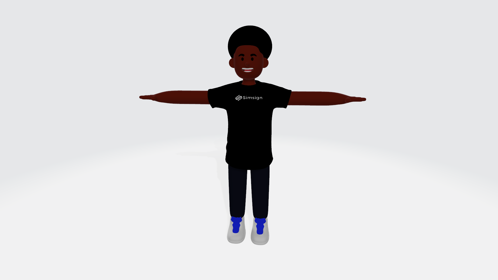
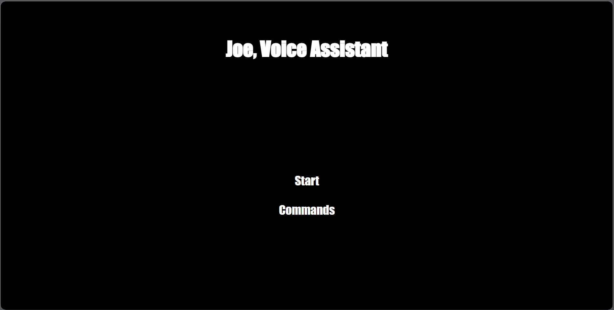
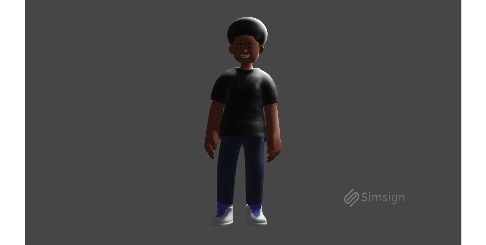

# Joe - Your Personal Assistant

## Introduction

Meet Joe, a virtual voice assistant ready to make your day a little bit easier. Crafted with an interactive 3D design, Joe combines modern web technologies to provide a delightful and engaging user experience. Whether you're looking to set reminders, search the web, or just chat, Joe is here to help.

## Features

- **Voice Activated**: Just say "Hey Joe" and he's ready to assist.
- **Dynamic 3D Animations**: Joe is not just any voice assistant; he comes to life with beautiful 3D animations.
- **Simple Commands**: Ask Joe about himself, his creators, or even how he's feeling today. He's got an answer for you.
- **Responsive Design**: Whether on desktop or mobile, Joe is designed to look and function beautifully.

## Technologies Used

- **Blender 3D**: For creating dynamic 3D animations.
- **Javascript**: Powers the voice recognition and processing features.
- **HTML & CSS**: Builds and styles the user interface.

## How to Use

Open the webpage and you'll be greeted by Joe.  
Click on the 'Start' button to activate Joe's listening mode.  
Speak your command clearly. For instance, "Hey Joe, how are you?"  
Joe will process your command and respond accordingly.  
For a list of commands Joe recognizes, see the list below.

### Recognized Commands

- "how are you"
- "who are you"
- "who made you"
- "hey"
- "Joe"
- "who owns you"
- "what are you doing"
- "when is your birthday"
- "goodnight"
- "good morning"
- "thank you"
- "please tell me about your company"
- "open my instagram"
- "open google"
- "the weather in my location"
- "where am i"
- "direction"
- "compose"
- "mail"
- "email"
- "tell me about"
- "play"
- "volume"
- "show me"

## Screenshots & Videos

[Demo](https://www.instagram.com/p/CkQwBOYrBfM/?utm_source=ig_web_copy_link&igshid=MzRlODBiNWFlZA==)

## Credits

- **Design & Development**: David Oyelade
- **3D Animations**: Created using Blender 3D.
- **Code**: Created using Javascript.
- **Special Thanks**: RazorLabs for their continuous support and guidance.
